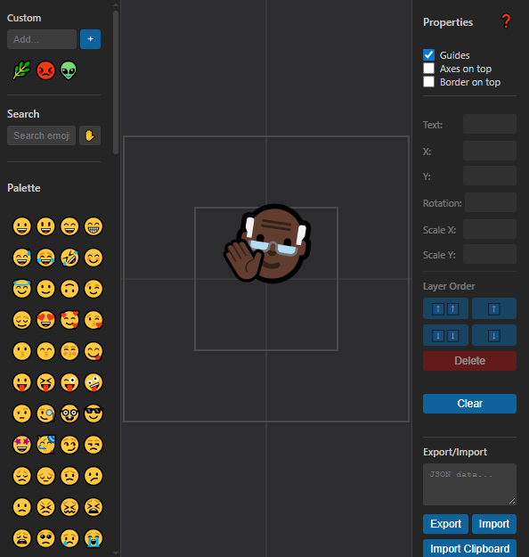

# Emoji Sprite Editor

A tool created for making sprites for quick game prototypes. Allows smashing emojis together to create different compositions.

Exports into a [simple JSON format](format.md) or a png image.

# Disclaimer

Created as an internal development tool.